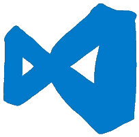
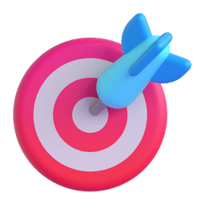

 

&nbsp;&nbsp;

 

##  About me

-  I ship fixes into open source used by **millions**, most recently **Bluesky**
-  I build **AI tooling on the Model Context Protocol**, my After Effects server exposes **47 tools** to AI clients
-  **Full-stack** across TypeScript, Node.js, React and Python, with C++ and Lua underneath
-  A rare specialty in **Arabic / RTL / i18n**, I make software correct in both directions
-  Based in Saudi Arabia, building and collaborating worldwide

 

##  Featured project

### <a href="https://github.com/a-y-ibrahim/after-effects-mcp">after-effects-mcp</a>

**An MCP server for controlling Adobe After Effects from AI clients.**

ExtendScript execution, background rendering, deep project and layer inspection,
and first-class Arabic / RTL and multilingual support, all in **47 tools**.

 

##  Open-source contributions

**Real code in projects with a combined 100K+ stars.** I ship small, reviewable pull requests upstream, not forks left to rot.

&nbsp;

 

| Project | Stars | What I shipped | Status |
| :-- | :--: | :-- | :--: |
| **[bluesky-social/social-app](https://github.com/bluesky-social/social-app/pull/11066)** |  | Stopped invisible bidi characters from leaking into copied handles across the web app | <!--status:bluesky-social/social-app#11066--><!--/status--> |
| **[punkpeye/awesome-mcp-servers](https://github.com/punkpeye/awesome-mcp-servers/pull/9214)** |  | Added my After Effects MCP server to the canonical list | <!--status:punkpeye/awesome-mcp-servers#9214--><!--/status--> |

##  Tech I build with

 

<b>More about how I work</b> (click to expand)

 

-  I care about **accessibility and internationalization**, especially getting RTL right, because half-broken Arabic UIs are everywhere and I enjoy fixing them.
-  I like connecting **AI clients to real creative tools** (that is where After Effects + MCP came from).
-  I ship small, reviewable pull requests upstream instead of forking and forgetting.

##  Watch the snake eat my contributions

<picture>
<source media="(prefers-color-scheme: dark)" srcset="https://raw.githubusercontent.com/a-y-ibrahim/a-y-ibrahim/output/github-snake-dark.svg" />
<source media="(prefers-color-scheme: light)" srcset="https://raw.githubusercontent.com/a-y-ibrahim/a-y-ibrahim/output/github-snake.svg" />

</picture>

 

<b>~</b> <a href="https://a-y-ibrahim.com/">a-y-ibrahim.com</a>

